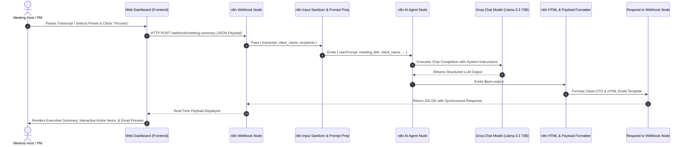

# System Architecture & Flow Document (AI Agent Architecture)

## 1. High-Level Architecture Overview

The system bridges an interactive client-side web application with a modern n8n **AI Agent** architecture leveraging Groq Cloud's LLM inference engine (`llama-3.3-70b-versatile`).

---

## 2. n8n Node Breakdown & Execution Topology

| Node Name | Node Type | Purpose & Logic |
| :--- | :--- | :--- |
| **1. Webhook Ingestion** | `n8n-nodes-base.webhook` | Receives incoming HTTP POST requests on `/webhook/meeting-summary` containing `transcript`, `title`, and `recipient_email`. Configured to `responseMode: "responseNode"`. |
| **2. Sanitize & Prepare Prompt** | `n8n-nodes-base.code` | Validates transcript length (>20 chars), formats the `userPrompt` string, and passes metadata forward. |
| **3. AI Agent Node** | `@n8n/n8n-nodes-langchain.agent` | LangChain Agent configured with `promptType: "define"` referencing `={{ $json.userPrompt }}` and system message extraction instructions. |
| **4. Groq Chat Model** | `@n8n/n8n-nodes-langchain.lmChatGroq` | Connected to AI Agent's `Chat Model*` connector. Model: `llama-3.3-70b-versatile`, temperature `0.1`. |
| **5. Parse & Validate Schema** | `n8n-nodes-base.code` | Parses the AI Agent `$json.output`, strips markdown fences if present, and ensures required keys exist. |
| **6. Generate HTML Email Template** | `n8n-nodes-base.code` | Dynamically compiles a responsive HTML email template using inline CSS and priority badges. |
| **7. Respond to Webhook** | `n8n-nodes-base.respondToWebhook` | Synchronously returns `{ status: "success", data: structured_data, email_html: htmlEmail, timestamp: ISO }` to the frontend. |
